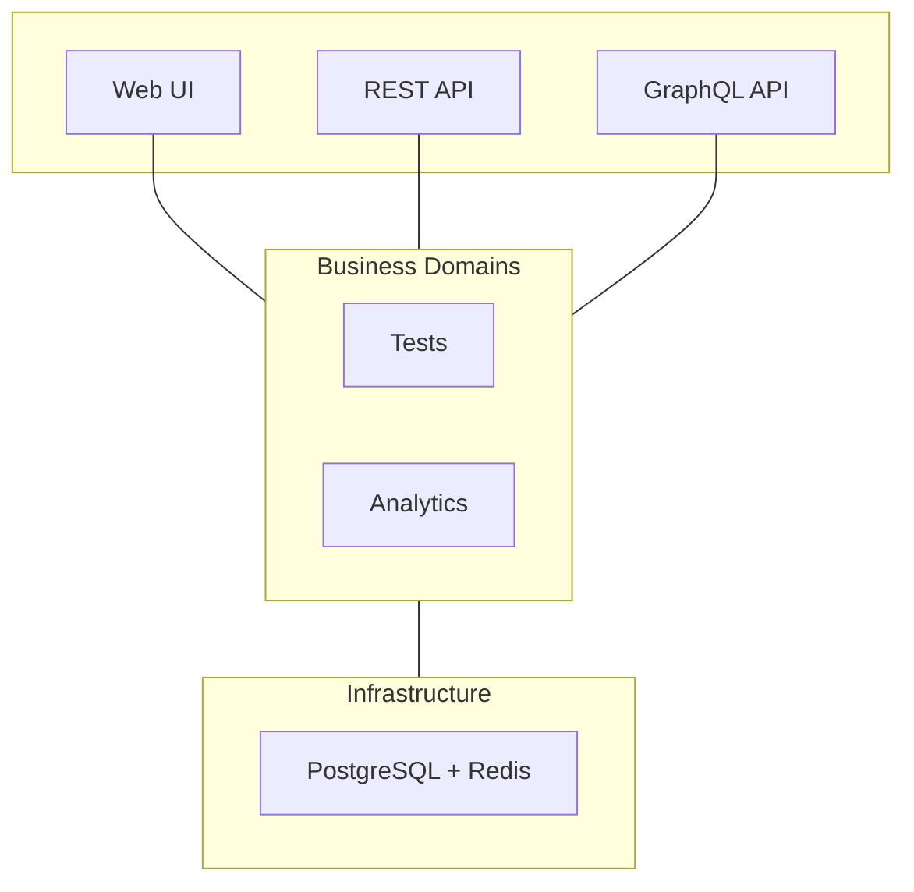

# Fern Platform

[](https://golang.org)
[](LICENSE)
[](https://goreportcard.com/report/github.com/guidewire-oss/fern-platform)
[](https://codecov.io/gh/guidewire-oss/fern-platform)
[](https://github.com/guidewire-oss/fern-platform/actions/workflows/ci.yml)
[](https://discord.gg/GfGQhMDAzS)

A unified test intelligence platform that transforms fragmented test data into actionable insights.

## What is Fern Platform?

Fern Platform aggregates test results from any CI/CD pipeline and testing framework (Jest, pytest, JUnit, etc.) into a centralized dashboard. It automatically detects flaky tests, tracks performance trends, and provides the visibility engineering teams need to maintain healthy test suites.

Think of it as a specialized analytics platform for your tests - like Datadog or Grafana, but purpose-built for test intelligence. **We're on a mission to make test failures predictable and preventable through AI-powered insights.**


## Key Features

- **Universal Test Aggregation** - REST API accepts test results from any framework or CI/CD system
- **Flaky Test Detection** - Automatically identifies tests that pass/fail intermittently
- **Performance Monitoring** - Track test execution times and identify slow tests
- **Interactive Visualizations** - Treemap view shows test suite health at a glance
- **Team-Based Access Control** - OAuth/SSO with role-based permissions
- **Rich Querying** - GraphQL API for complex test data analysis
- **v2 SPA** - Modern React frontend with filtering, saved views, and treemap drill-down (opt-in, served at `/v2`)

## Quick Start

### Requirements

Choose based on your installation method:

**For Docker:**
- Docker Engine 20.10+
- PostgreSQL 14+ (external or containerized)
- Redis 6+ (external or containerized)

**For Kubernetes deployment:**
- Docker with buildx
- [k3d](https://k3d.io/stable/#installation) (lightweight Kubernetes)
- kubectl
- Go 1.21+ (used by Makefile for architecture detection)
- Make
- 8GB RAM minimum

### Installation

Choose your preferred installation method:

#### Option 1: Docker (Coming Soon)

Docker images will be available after the v0.1.0 release:
- GitHub Container Registry: `ghcr.io/guidewire-oss/fern-platform:latest`
- Docker Hub: `docker.io/guidewireoss/fern-platform:latest`

```bash
# Generate JIRA encryption key (optional, only needed if using JIRA integration)
JIRA_KEY=$(openssl rand -hex 32)

# Future usage (not yet available):
docker run -d \
  --name fern-platform \
  -p 8080:8080 \
  -e DB_HOST=host.docker.internal \
  -e DB_USER=postgres \
  -e DB_PASSWORD=yourpassword \
  -e DB_NAME=fern_platform \
  -e REDIS_HOST=host.docker.internal \
  -e JIRA_ENCRYPTION_KEY=$JIRA_KEY \
  ghcr.io/guidewire-oss/fern-platform:latest
```

For now, please use Option 2 (Kubernetes deployment) or build from source.

#### Option 2: Kubernetes with OAuth (Full Features)

```bash
# Clone the repository
git clone https://github.com/guidewire-oss/fern-platform
cd fern-platform

# Add required hosts entries (for OAuth to work)
echo "127.0.0.1 fern-platform.local" | sudo tee -a /etc/hosts
echo "127.0.0.1 keycloak" | sudo tee -a /etc/hosts

# Deploy with the v2 SPA frontend (recommended)
make deploy-all-v2

# Or deploy with the classic v1 frontend
make deploy-all
```

| URL | Description |
|-----|-------------|
| `http://fern-platform.local:8080/v2` | v2 SPA (modern React frontend) |
| `http://fern-platform.local:8080` | v1 classic frontend |

**Default credentials**: `admin@fern.com` / `test123`

> **Behind a corporate proxy?** If your k3d cluster nodes can't pull images from Docker Hub
> due to TLS inspection, run `make deploy-quick-v2` after manually importing the required
> images: `docker pull redis:7-alpine quay.io/keycloak/keycloak:23.0 && k3d image import redis:7-alpine quay.io/keycloak/keycloak:23.0 -c fern-platform`

### Basic Usage

1. **Manager creates a project** in the Fern Platform UI
2. **Developers install a client library** for their test framework:

#### Official Client Libraries

- **Go/Ginkgo**: [fern-ginkgo-client](https://github.com/guidewire-oss/fern-ginkgo-client)
- **Java/JUnit**: [fern-junit-client](https://github.com/guidewire-oss/fern-junit-client) and [Gradle plugin](https://github.com/guidewire-oss/fern-junit-gradle-plugin)
- **JavaScript/Jest**: [fern-jest-client](https://github.com/guidewire-oss/fern-jest-client)

#### Build Your Own Client

Missing your framework? Create your own client library! See our [client development guide](docs/developers/integration-guide.md#building-your-own-client-library) to:
- Build clients for Python, Ruby, PHP, .NET, or any other language
- Integrate with pytest, RSpec, PHPUnit, NUnit, or any test framework
- Contribute back to the community

3. **Configure with your project ID**:

```bash
export FERN_PROJECT_ID=my-project
export FERN_URL=http://fern-platform.local:8080
```

Test results are automatically sent to Fern Platform!

View results in the dashboard or query via GraphQL:

```graphql
query {
  testRuns(projectId: "my-project", first: 10) {
    runs {
      id
      status
      duration
      gitCommit
    }
  }
}
```

## Documentation

### Quick Links by Role

**For Users** → [UI Features Guide](docs/user-guide/ui-features.md) • [Workflows](docs/workflows/README.md) • [Use Cases](docs/use-cases/)

**For Developers** → [Integration Guide](docs/developers/integration-guide.md) • [Link Tests to JIRA](docs/developers/linking-tests-to-jira.md) • [Development](docs/developers/quick-start.md) • [API Reference](docs/developers/api-reference.md) • [GraphQL](docs/graphql-api.md)

**For DevOps** → [Installation](docs/developers/quick-start.md) • [Configuration](docs/configuration/) • [Troubleshooting](docs/troubleshooting/README.md)

**For Contributors** → [Architecture](docs/ARCHITECTURE.md) • [Contributing](CONTRIBUTING.md) • [RFCs](docs/rfc/)

### All Documentation

See [complete documentation index](docs/all-docs.md) or browse [docs/](docs/) directly.

## Use Cases

Fern Platform helps engineering teams:

- **Identify flaky tests** that waste CI time and erode confidence
- **Track test performance** to find and fix slow tests
- **Monitor test health** across multiple projects and teams
- **Debug failures** with historical context and error patterns

See our [use case guides](docs/use-cases/) for detailed examples.

## Integration Examples

### JavaScript/Jest

```javascript
// jest.config.js
module.exports = {
  reporters: [
    'default',
    ['@guidewire/fern-jest-client', {
      url: process.env.FERN_URL,
      projectId: process.env.FERN_PROJECT_ID
    }]
  ]
};
```

### Java/JUnit with Gradle

```gradle
plugins {
  id 'com.guidewire.fern' version '1.0.0'
}

fern {
  url = System.getenv('FERN_URL')
  projectId = System.getenv('FERN_PROJECT_ID')
}
```

### Go/Ginkgo

```go
import "github.com/guidewire-oss/fern-ginkgo-client/reporter"

var _ = ginkgo.BeforeSuite(func() {
  ginkgo.RunSpecs(t, "My Suite", reporter.NewFernReporter())
})
```

See [integration guide](docs/developers/integration-guide.md) for more examples.

## Architecture

Fern Platform uses domain-driven design with a hexagonal architecture:



## v2 SPA Frontend

Fern Platform ships a modern React SPA alongside the classic server-rendered UI. Both are served from the same binary — the v2 frontend is opt-in so existing deployments are unaffected.

### Enabling v2

The v2 frontend is **off by default**. Set the environment variable to opt in:

```bash
FERN_V2_UI_ENABLED=true
```

For Kubernetes deployments, edit `deployments/fern-platform-kubevela.yaml` and set the value to `"true"`. For Docker Compose, add it to your `config.local.yaml` or pass it via the environment.

### URL layout

| Path | Serves |
|------|--------|
| `/v2` | v2 SPA (index.html + assets) |
| `/v2/*` | Client-side routes (React Router handles them) |
| `/api/v2/*` | REST endpoints used exclusively by the v2 SPA |
| `/` | v1 classic frontend (unchanged) |
| `/api/v1/*` | Legacy GraphQL + REST (unchanged) |

### v2 feature highlights

- **Filtered test-run list** — server-side filtering by status, branch, tag, and date with keyset pagination
- **Saved views** — bookmark filter combinations per page (stored per user)
- **Treemap drill-down** — click into a project → suite → spec to trace failure patterns
- **Dark mode** — persisted per-user via profile settings
- **JIRA coverage** — link spec runs to JIRA issues and visualize coverage hierarchy

### Building the v2 SPA locally

```bash
# Install dependencies and build (outputs to internal/web/dist/)
make web-v2-build

# Run the dev server with hot-reload (proxies API calls to a running backend)
cd web-v2 && pnpm dev
```

## The Vision: Where We're Heading

While Fern Platform already provides powerful test analytics, we're building towards something bigger: **an AI-powered test intelligence system that predicts failures before they happen**.

### 🚀 Coming Soon

**AI-Powered Intelligence** (In Development)
- Automatic root cause analysis for failures
- Predictive test failure detection
- Smart test selection for faster CI/CD
- Natural language queries: "Why did the auth tests fail last week?"

**Enhanced Integrations** (Q1 2025)
- Native plugins for Jest, pytest, Go, JUnit
- GitHub Actions & GitLab CI apps
- Slack/Teams notifications with insights
- JIRA auto-ticket creation for failures

**Real-Time Features** (Q2 2025)
- Live test execution monitoring
- WebSocket subscriptions for dashboards
- Streaming logs from CI/CD pipelines

See our [RFCs](docs/rfc/) for detailed technical proposals and join the [discussion](https://github.com/guidewire-oss/fern-platform/discussions).

## Project Status

Fern Platform is under active development with core features stable and used in production.

**Ready Now**: Test aggregation • Flaky detection • Performance tracking • OAuth • REST/GraphQL APIs  
**In Progress**: AI insights • Webhook integrations • Enhanced visualizations  
**Exploring**: ML-based test optimization • Distributed tracing for tests

## Contributing

We welcome contributions! See [CONTRIBUTING.md](CONTRIBUTING.md) for guidelines.

Areas where we need help:
- **Client libraries** for new test frameworks (pytest, RSpec, PHPUnit, etc.)
- Test framework integrations
- UI/UX improvements
- Documentation
- Bug fixes

### Creating Client Libraries

Building a client for your favorite test framework? Check our [client development guide](docs/developers/integration-guide.md#building-your-own-client-library) and join our growing ecosystem!

## Community

- 💬 [**Join our Discord**](https://discord.gg/GfGQhMDAzS) - Our community server is the primary place for discussion, questions, and help. The invite is open to everyone — click to join. *(Already a member? [Open the server](https://discord.com/channels/1503382684951379978).)*
- [GitHub Discussions](https://github.com/guidewire-oss/fern-platform/discussions) - Ask questions and share ideas
- [Issue Tracker](https://github.com/guidewire-oss/fern-platform/issues) - Report bugs or request features

## License

Apache License 2.0 - see [LICENSE](LICENSE) for details.

---

<div align="center">
  <a href="docs/developers/quick-start.md">Get Started</a> •
  <a href="docs/developers/api-reference.md">API Docs</a> •
  <a href="https://github.com/guidewire-oss/fern-platform/issues">Report Issue</a>
</div>
